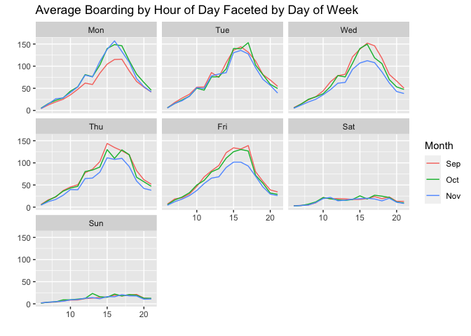
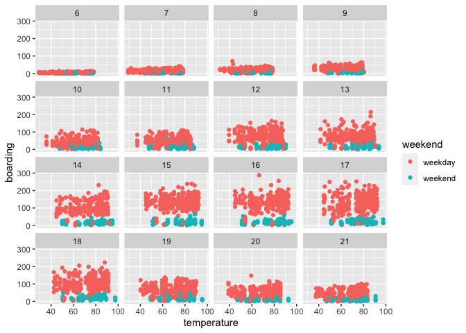
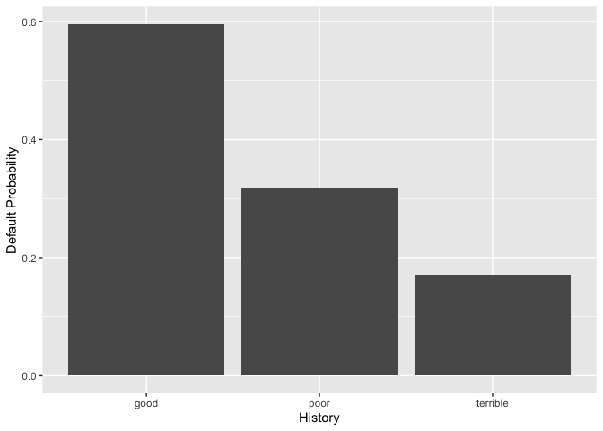
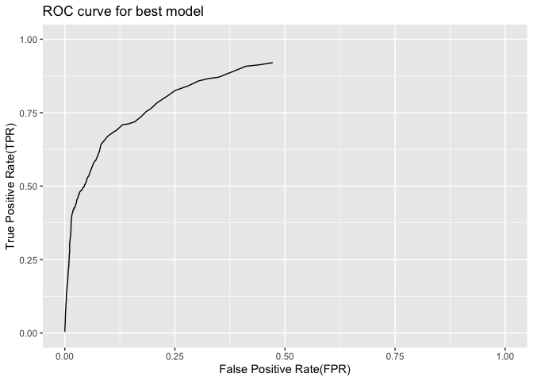

## Problem 1: visualization

 \* Average
boardings on weekdays show similar patterns. Saturday and Sunday have
significantly less boarding. For Monday through Friday, peak average
boarding happens between 3pm to 5pm. This could be because many college
students left campus around that time. Average boardings on Mondays in
September is lower than Mondays in other months because 1st Monday of
September is Labor day which we can expect fewer people riding the buses
so this day pulls the average down. Average boardings on Weds/Thurs/Fri
in November look lower could be due to Thanksgiving holiday so there is
less people riding the buses to and from UT.

 \* The plot
shows boarding by temperature faceted by hour of day and colored by
whether it is a weekday or a weekend. We see that ridership is high on
weekday during 1pm. to 5pm. This is because the temperature is
especially high during that period of time so more people might decide
to take buses instead of walking. When holding hour of day and weekend
status constant, temperature seem not to have a noticeable effect on
number of UT students riding the bus and the ridership remains low
compared to weekday.

## Problem 2: Saratoga house prices

    ## [1] 68944.62

    ## [1] 64324.62

    ## [1] 62120.23 59487.90 54167.18 51906.07 65173.44

    ## [1] 58570.96

    ## [1] 2458.097

    ## [1] 64700.99

    ## [1] 64700.99 64700.99 64700.99 64700.99 64700.99

    ## [1] 64700.99

    ## [1] 0

-   The linear model has rmse = 58667.24 while KNN has rmse = 66285.21.
    So linear model seems to do better at achieving lower out-of-sample
    mean-squared error. So the local taxing authority can use this model
    to predict market values. Another good thing for linear model is
    that we can see the t-statistics for each variables and see which
    variables are statistically significant.

## Problem 3: Classification and retrospective sampling

    ##         (Intercept)            duration              amount         installment 
    ##               -0.69                0.02                0.00                0.25 
    ##                 age         historypoor     historyterrible          purposeedu 
    ##               -0.02               -1.13               -2.14                0.96 
    ## purposegoods/repair       purposenewcar      purposeusedcar       foreigngerman 
    ##                0.16                0.95               -0.70               -1.50

    ##    yhat
    ## y     0   1
    ##   0 126  13
    ##   1  46  15

    ##    history default_prob_each_history
    ## 1 terrible                 0.1706485
    ## 2     poor                 0.3187702
    ## 3     good                 0.5955056

 \* We find
that having good history has higher probability of default than having
poor or terrible history which is not intuitive. The issue with this
data set is that it is not a random sample, rather it oversamples
defaults. So there are “too many” defaults relative to the good ones.
Therefore, this data set is not appropriate for building a predictive
model of defaults. The bank should use random sample.

## Problem 4: Children and hotel reservations

|             |      rmse |
|:------------|----------:|
| small model | 3.1195927 |
| big model   | 0.2332554 |
| best model  | 0.2330175 |

-   rmse for big model and best model are almost identical. While rmse
    for small model is a lot larger.

<!-- -->

    ## # A tibble: 1 x 3
    ##   model      true_pos_rate false_pos_rate
    ##   <chr>              <dbl>          <dbl>
    ## 1 best hotel         0.915          0.475

    ##        expected actual difference
    ## Fold01 14.3747  20     6         
    ## Fold02 20.11218 18     -2        
    ## Fold03 20.56589 18     -2        
    ## Fold04 22.5921  26     4         
    ## Fold05 20.45423 20     0         
    ## Fold06 25.73421 14     -11       
    ## Fold07 17.36216 14     -3        
    ## Fold08 22.16905 21     -1        
    ## Fold09 23.10447 25     2         
    ## Fold10 23.26298 19     -4        
    ## Fold11 23.21358 16     -7        
    ## Fold12 17.94687 21     4         
    ## Fold13 19.34231 20     1         
    ## Fold14 20.12016 23     3         
    ## Fold15 24.83254 26     2         
    ## Fold16 24.57717 25     1         
    ## Fold17 22.89692 22     0         
    ## Fold18 19.42378 20     1         
    ## Fold19 20.75147 17     -3        
    ## Fold20 19.64408 17     -2
